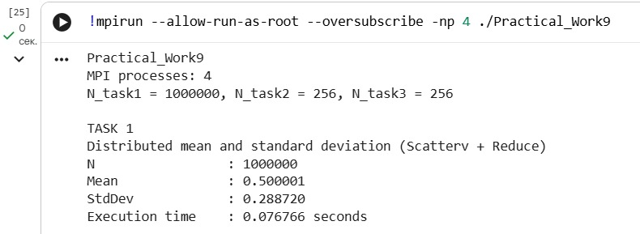
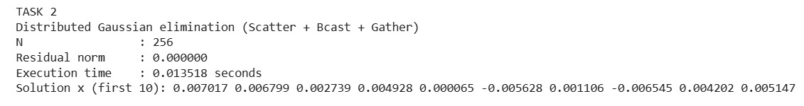
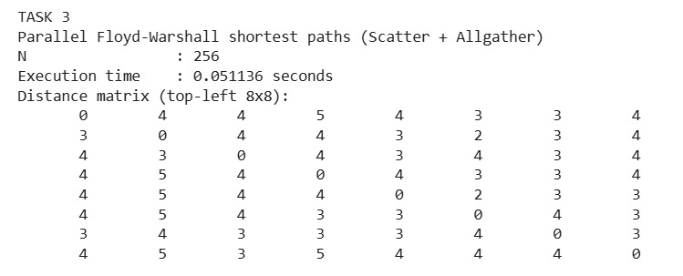

# Practical_Work9

Практическая работа №9 посвящена распределённой обработке данных с использованием MPI. Цель работы — научиться применять продвинутые коллективные операции MPI и построить программы, где данные и вычисления разделены между несколькими процессами. В этой работе реализованы три независимые задачи: вычисление среднего и стандартного отклонения для большого массива, распределённое решение СЛАУ методом Гаусса и параллельный поиск кратчайших путей в графе алгоритмом Флойда–Уоршелла. Во всех задачах измеряется время выполнения через `MPI_Wtime()`, чтобы затем сравнивать результаты при разных значениях `-np` и оценивать масштабируемость.

---

## Таск 1. Распределённое вычисление среднего и стандартного отклонения

В первом задании исходный массив случайных чисел создаётся только на процессе с `rank = 0`, после чего массив нужно корректно раздать всем процессам. Важный момент здесь в том, что размер массива `N` может не делиться на количество процессов, поэтому используется `MPI_Scatterv`. Эта функция позволяет отправить каждому процессу разное количество элементов, а именно столько, сколько нужно, чтобы разбиение было корректным и ни один элемент не потерялся.

Сначала на `rank = 0` генерируется массив, затем вычисляются два служебных массива: `counts`, где хранится, сколько элементов отправить каждому процессу, и `displs`, где хранится смещение (откуда в общем массиве начинается блок каждого процесса). После этого выполняется `MPI_Scatterv`, и каждый процесс получает свой локальный кусок данных. Далее каждый процесс независимо считает сумму своих элементов и сумму квадратов своих элементов. Эти значения передаются обратно на `rank = 0` с помощью `MPI_Reduce`, который суммирует локальные результаты в глобальные суммы. Когда на `rank = 0` уже есть общая сумма и общая сумма квадратов, можно вычислить среднее значение и стандартное отклонение по формуле через дисперсию. В конце программа выводит итоговые значения и время выполнения.

Результаты выполнения программы представлены на скриншоте:

  

  

**Заключение по результатам:** `MPI_Scatterv` обеспечивает правильное разбиение массива при любом `N` и любом количестве процессов, а `MPI_Reduce` позволяет собрать частичные суммы без ручной пересылки сообщений. За счёт того, что вычисления сумм выполняются локально на процессах, основная коммуникация ограничивается только двумя коллективными операциями, что делает задачу хорошо масштабируемой на больших массивах.

---

## Таск 2. Распределённое решение СЛАУ методом Гаусса

Во втором задании решается система линейных уравнений `Ax = b`, где матрица `A` имеет размер `N×N`, а вектор `b` имеет размер `N`. Исходные данные создаются на `rank = 0`, после чего строки матрицы распределяются между процессами с помощью `MPI_Scatter`. Особенность в том, что `MPI_Scatter` требует одинаковый объём отправки каждому процессу, поэтому чтобы программа работала корректно при любом количестве процессов, используется выравнивание количества строк: вычисляется `rows_per_proc = ceil(N / size)`, а затем формируется “паддинг” до `padded_rows = rows_per_proc * size`. Если `padded_rows` больше `N`, добавляются лишние строки (нули), которые не участвуют в вычислениях. Это сделано только для того, чтобы Scatter работал одинаковыми блоками.

После распределения строк начинается прямой ход метода Гаусса. Для каждого шага `k` существует одна pivot-строка, которую должны знать все процессы, потому что она используется при вычитании для зануления элементов ниже диагонали. Владелец pivot-строки определяется по формуле, после чего pivot-строка рассылается всем процессам через `MPI_Bcast`. Далее каждый процесс обновляет только те строки, которые находятся у него локально и имеют глобальный индекс больше `k`. Таким образом, вычитание строк выполняется параллельно на разных процессах, но pivot-строка на каждом шаге синхронно известна всем.

Когда прямой ход завершён, локальные куски матрицы и правой части собираются обратно на `rank = 0` через `MPI_Gather`. Обратный ход выполняется на `rank = 0`, после чего выводится часть решения и вычисляется невязка `||Ax - b||`, чтобы убедиться, что решение корректное и система решена правильно.

Результаты выполнения программы представлены на скриншоте:

  

  

**Заключение по результатам:** в распределённом Гауссе ключевую роль играет `MPI_Bcast`, потому что без передачи pivot-строки другие процессы не смогут выполнять исключение для своих строк. При росте числа процессов вычисления действительно делятся, но количество широковещательных передач остаётся равным числу шагов `N`, поэтому на больших `N` и больших `-np` коммуникации начинают заметно влиять на время выполнения.

---

## Таск 3. Параллельный поиск кратчайших путей (Флойд–Уоршелл)

В третьем задании реализуется параллельная версия алгоритма Флойда–Уоршелла для матрицы расстояний `G` размера `N×N`. Матрица смежности создаётся на `rank = 0`, затем строки распределяются по процессам с помощью `MPI_Scatter`. Здесь используется тот же приём выравнивания количества строк, чтобы Scatter работал при любом количестве процессов.

Смысл алгоритма Флойда–Уоршелла в том, что на каждой итерации `k` обновляется каждая пара `(i, j)` по формуле `dist[i][j] = min(dist[i][j], dist[i][k] + dist[k][j])`. Чтобы каждый процесс мог корректно обновлять свои строки, ему нужны актуальные значения строки `k` и актуальные значения `dist[i][k]`. Для этого на каждой итерации выполняется `MPI_Allgather`. В результате каждый процесс получает согласованную “глобальную” матрицу (по блокам строк), после чего обновляет только свою локальную часть. После завершения всех итераций итоговые данные собираются на `rank = 0` через `MPI_Gather`, и в консоль выводится небольшой фрагмент матрицы, чтобы продемонстрировать результат и не перегружать вывод.

Результаты выполнения программы представлены на скриншоте:

  

  

**Заключение по результатам:** `MPI_Allgather` гарантирует, что у всех процессов на каждой итерации есть согласованные данные для корректного обновления расстояний, но эта операция дорогая, потому что выполняется `N` раз и передаёт большие объёмы данных. Поэтому при увеличении `-np` вычислительная часть может ускоряться, но коммуникации могут начать доминировать и ограничивать масштабируемость.

---

# Контрольные вопросы

## 1. Как изменяется время выполнения программы при увеличении количества процессов? Почему?

Время выполнения обычно уменьшается, потому что вычисления распределяются между несколькими процессами. Однако уменьшение не является линейным: по мере роста числа процессов растут накладные расходы на обмен данными и синхронизацию. В задачах, где много коллективных обменов (особенно `MPI_Allgather`), увеличение `-np` может дать слабый выигрыш или даже ухудшение времени из-за доминирования коммуникаций.

## 2. Какие факторы могут влиять на производительность программы?

На производительность влияет размер данных, число процессов, балансировка нагрузки (равномерность распределения), объём и частота обменов, задержки сети и пропускная способность, а также количество синхронизаций. Кроме того, на практике влияет архитектура кластера: топология сети и характеристики узлов.

## 3. Как можно оптимизировать передачу данных между процессами?

Оптимизация обычно начинается с сокращения объёма обмена и частоты коллективных операций. Можно использовать неблокирующие операции MPI для перекрытия коммуникаций вычислениями, объединять маленькие сообщения в более крупные, переходить к более экономным схемам обмена (например, передавать только нужные строки/блоки, а не всю матрицу), а также использовать блочную декомпозицию данных.

## 4. Какие ограничения возникают при работе с большими данными?

Основные ограничения связаны с памятью и коммуникациями. Для больших матриц `N×N` быстро заканчивается память, особенно если каждый процесс должен хранить значительную часть данных. Также растёт стоимость обмена: передача больших блоков данных между процессами становится главным ограничением времени. Дополнительно многие алгоритмы имеют высокую вычислительную сложность (например, Флойд–Уоршелл — `O(N^3)`), поэтому при большом `N` время становится слишком большим даже при распараллеливании.

---

# Ззаключение

В практической работе №9 были реализованы три распределённые задачи, каждая из которых демонстрирует важные принципы MPI. В первой задаче показано корректное распределение данных при любом размере массива с помощью `MPI_Scatterv` и эффективное суммирование результатов через `MPI_Reduce`. Во второй задаче продемонстрировано, как организовать распределённый прямой ход метода Гаусса, где критически важна рассылка pivot-строки через `MPI_Bcast`, а затем сбор результатов через `MPI_Gather`. В третьей задаче показан параллельный алгоритм Флойда–Уоршелла, где для корректности требуется согласованность данных между процессами и используется `MPI_Allgather` на каждой итерации.

Главный практический вывод заключается в том, что ускорение MPI-программ зависит не только от количества процессов, но и от стоимости коммуникаций. Если обмен данными редкий и небольшой, масштабируемость обычно хорошая. Если же алгоритм требует частых коллективных операций и передачи больших блоков данных, коммуникации начинают доминировать и ограничивают выигрыш от увеличения `-np`. Именно поэтому при разработке распределённых решений важно проектировать алгоритмы так, чтобы минимизировать объём передачи данных и количество глобальных синхронизаций.
